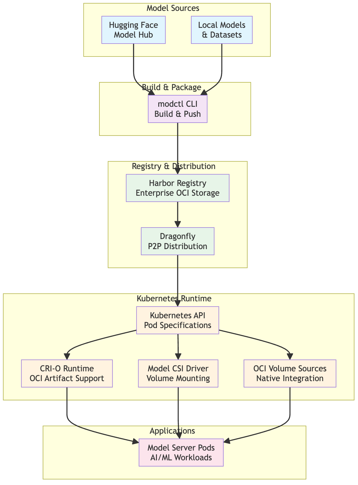

# Getting Started with CNCF ModelPack Specification

Welcome to the CNCF ModelPack Specification project! This guide will help you understand the specification and its role in the broader AI/ML ecosystem, as well as providing practical steps to get started.

## What is the ModelPack Specification?

The CNCF ModelPack Specification is an open standard for packaging, distributing, and running AI models in cloud-native environments. It builds upon the proven [OCI (Open Container Initiative) image specification](https://github.com/opencontainers/image-spec/) to bring the same standardization and interoperability benefits that containers brought to application deployment to the world of AI models.

### Why This Matters

We are entering the fourth age of infrastructure evolution:

1. **Machine-centric** (GNU/Linux distributions)
2. **Virtual Machine-centric** (Cloud computing, virtualization)
3. **Container-centric** (Docker, Kubernetes, OCI standards)
4. **AI Model-centric** (Current era - AI model development and deployment)

Just as OCI standards revolutionized how we package and distribute applications, the ModelPack specification aims to standardize AI model packaging and distribution, moving away from vendor-specific formats toward an open, interoperable standard.

## The ModelPack Ecosystem

The ModelPack specification is designed to integrate seamlessly with existing cloud-native and AI/ML tools. Here's how the key components work together:



### Core Infrastructure

This section lists the core infrastructure components that ModelPack is working with.

- **[OCI Registries](https://github.com/opencontainers/distribution-spec)**: Store model artifacts using the same proven infrastructure as container images. One example of such implementation of an OCI registry is **[Harbor](https://goharbor.io/)**, which provides enterprise-grade OCI registry service that can host model artifacts with security scanning, policy management, and RBAC.
- Model distribution service: Provide efficient model artifacts distribution. One example of such implementation is **[Dragonfly](https://d7y.io/)**, a P2P-based file distribution system at scale.

### Model Management Tools

- **[modctl](https://github.com/modelpack/modctl)**: CLI tool for building, pushing, pulling, and managing OCI model artifacts
- **[KitOps](https://kitops.ml/)**: ModelKit packaging and deployment platform that supports the ModelPack specification

### Kubernetes Integration

- **[Model CSI Driver](https://github.com/modelpack/model-csi-driver)**: Kubernetes CSI driver for mounting model artifacts as persistent volumes
- **[OCI Volume Sources](https://kubernetes.io/blog/2024/08/16/kubernetes-1-31-image-volume-source/)**: Mount model artifacts directly as volumes in Kubernetes pods without init containers
- **[CRI-O](https://cri-o.io/)**: Container runtime that supports OCI artifacts, enabling seamless model deployment in Kubernetes environments

## Key Benefits

- **Standardization**: The use of familiar OCI tooling and infrastructure for AI models
- **Interoperability**: Models packaged once work across different platforms and tools
- **Security**: Leverage existing OCI security features like image signing and vulnerability scanning
- **Efficiency**: Native Kubernetes integration eliminates the need for manually downloading models
- **Versioning**: The use of OCI tags and digests enables robust model version control
- **Ecosystem**: Build on top of the mature container ecosystem, rather than creating new infrastructure and components

## Getting Started

### Prerequisites

- Basic understanding of containers and OCI concepts
- Access to an OCI-compatible registry (Docker Hub, Harbor, etc.)

### Practical Steps

#### 1. Install modctl

Follow the instructions to install `modctl` from the [modctl GitHub repository](https://github.com/modelpack/modctl/blob/main/docs/getting-started.md#installation) to install the CLI tool.

#### 2. Install Model CSI Driver

If you plan to use models in Kubernetes, install the Model CSI Driver by following the instructions in the [Model CSI Driver repository](https://github.com/modelpack/model-csi-driver/blob/main/docs/getting-started.md#helm-installation).

#### 3. Download A Model

To package a model, you need to download it to your local directory. The following example shows how to download a model from Huggingface.

```bash
export HF_MODEL="Qwen/Qwen3-0.6B"
export MODEL_PATH=my-model-directory

# Install the huggingface cli
pip install 'huggingface_hub'

# Login the huggingface cli
hf auth login --token <your-huggingface-token>

# Download a model
hf download $HF_MODEL --local-dir $MODEL_PATH
```

#### 4. Package Your First Model

The following script will walk through how to build a ModelPack format model artifact and push it to the model registry.

```bash
# Please modify the MODEL_REGISTRY environment variable to point to your OCI model registry
export MODEL_REGISTRY=myregistry.com

# If $MODEL_REGISTRY needs authentication, please login first
modctl login -u <username> -p <password> $MODEL_REGISTRY

# Generate a sample Modelfile, and edit the fields as needed
modctl modelfile generate $MODEL_PATH

# Build a model artifact from your model files
modctl build -t $MODEL_REGISTRY/mymodel:v1.0 $MODEL_PATH

# Push to an OCI registry
modctl push $MODEL_REGISTRY/mymodel:v1.0
```

#### 5. Use Models in Kubernetes

Here's an example Kubernetes pod spec that mounts a model artifact using the model CSI driver. The model will be available under the `/model` directory inside the container.

```yaml
apiVersion: v1
kind: Pod
metadata:
  name: model-inference-pod
spec:
  containers:
    - name: inference-server
      image: ubuntu:24.04
      command: ["sleep", "infinity"]
      volumeMounts:
        - name: model-volume
          mountPath: /model
          readOnly: true
  volumes:
    - name: model-volume
      csi:
        driver: model.csi.modelpack.org
        volumeAttributes:
          modelRef: "myregistry.com/mymodel:v1.0"
```

This example shows how to mount a model artifact directly into a Kubernetes pod using the model CSI driver. The contents of the model is available within the /model directory within the running pod.

## Next Steps

1. **Explore the [full ModelPack specification](./spec.md)** for technical implementation details
2. **Try more options of the [modctl tool](https://github.com/modelpack/modctl)** for additional hands-on experience
3. **Join the community** on [CNCF Slack #modelpack](https://cloud-native.slack.com/archives/C07T0V480LF)
4. **Contribute** to the ModelPack project - see our [contributing guidelines](../CONTRIBUTING.md)

## Additional Resources

- [OCI Image Specification](https://github.com/opencontainers/image-spec)
- [Harbor Project](https://goharbor.io/)
- [Dragonfly Project](https://d7y.io/)
- [CRI-O](https://cri-o.io/)
- [KitOps](https://kitops.ml/)
- [Hugging Face](https://huggingface.co/)

The ModelPack specification represents the next evolution in infrastructure standardization, bringing the benefits of containerization to AI model management. Start with the basics, explore the ecosystem, and join our growing community of contributors and users building the future of cloud-native AI.
